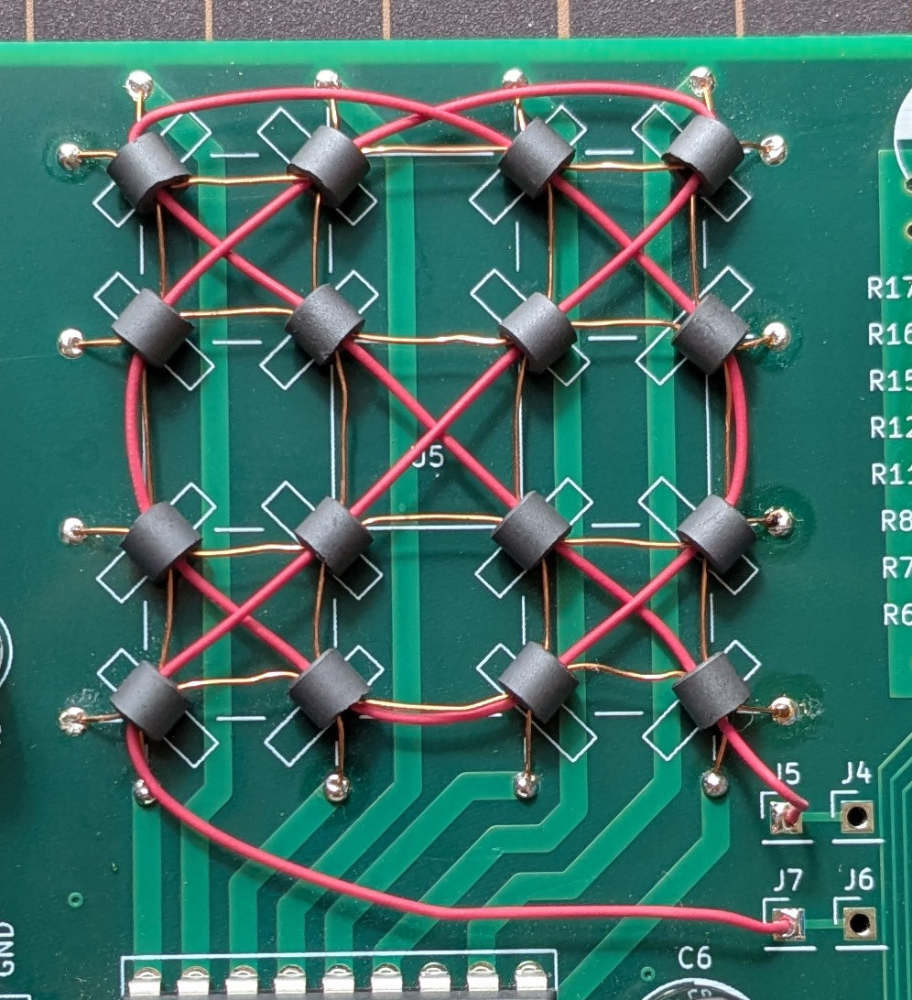

# 4x4 Core Memory System

This page has written after a while since the circuit was made so this page could not be accurate information.

## Cores

Used cores were obtained at AliExpress. They originally seem to be for EMI filter, and are not for deadstock cores for memory.
The description of cores was ``100pcs Hollow Ferrite Double Hole Beads 3.5*3*1.5 4*2*2 mm anti-interference Cores EMI Filter Ring Nickel Zinc Through Flux``

